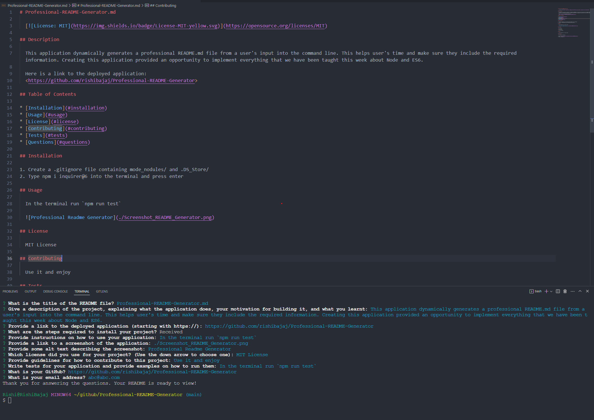

# Professional-README-Generator.md

  

## Description

  This application dynamically generates a professional README.md file from a user's input into the command line. This helps user's time and make sure they include the required information. Creating this application provided an opportunity to implement everything that we have been taught this week about Node and ES6.

  Here is a link to the deployed application:
  <https://github.com/rishibajaj/Professional-README-Generator>

## Table of Contents

* [Installation](#installation)
* [Usage](#usage)
* [License](#license)
* [Contributing](#contributing)
* [Tests](#tests)
* [Questions](#questions)

## Installation

1. Create a .gitignore file containing mode_nodules/ and .DS_Store/
2. Type npm i inquirer@6 into the terminal and press enter

## Usage

  In the terminal run `npm run test`

  

## License

  MIT License

## Contributing

  Use it and enjoy

## Tests

  In the terminal run `npm run test`

## Questions

  For further information:
  
* Visit: <https://github.com/rishibajaj/Professional-README-Generator>
* Contact: abc@abc.com
